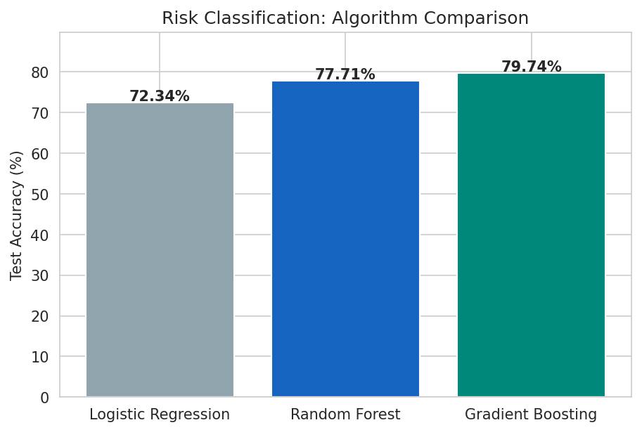
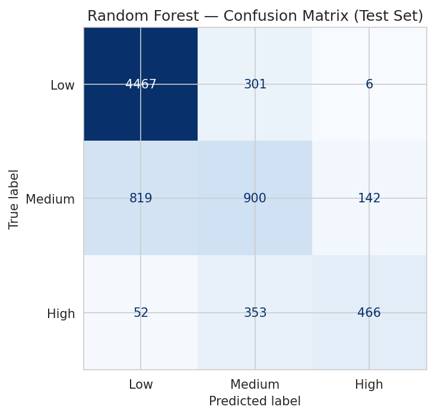
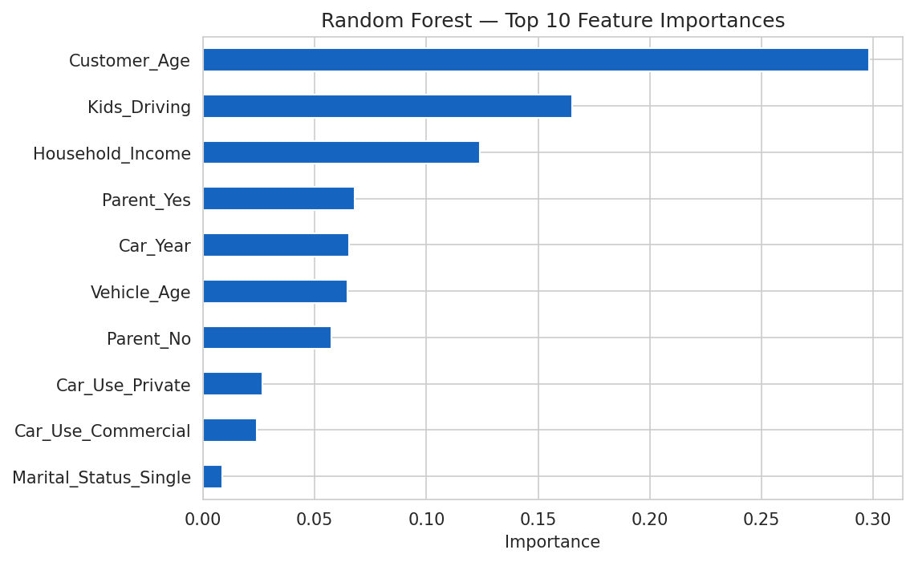
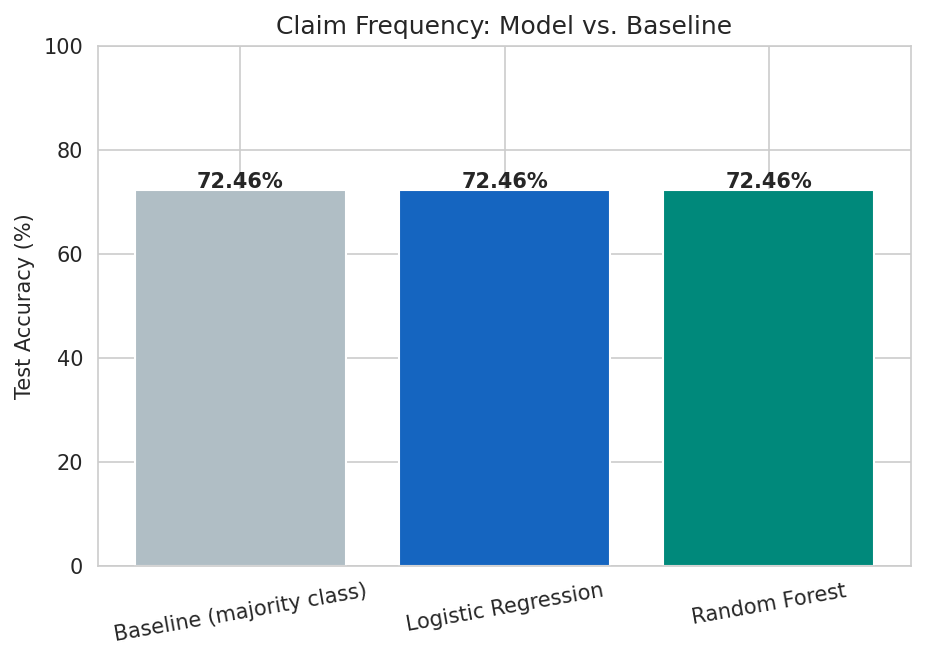
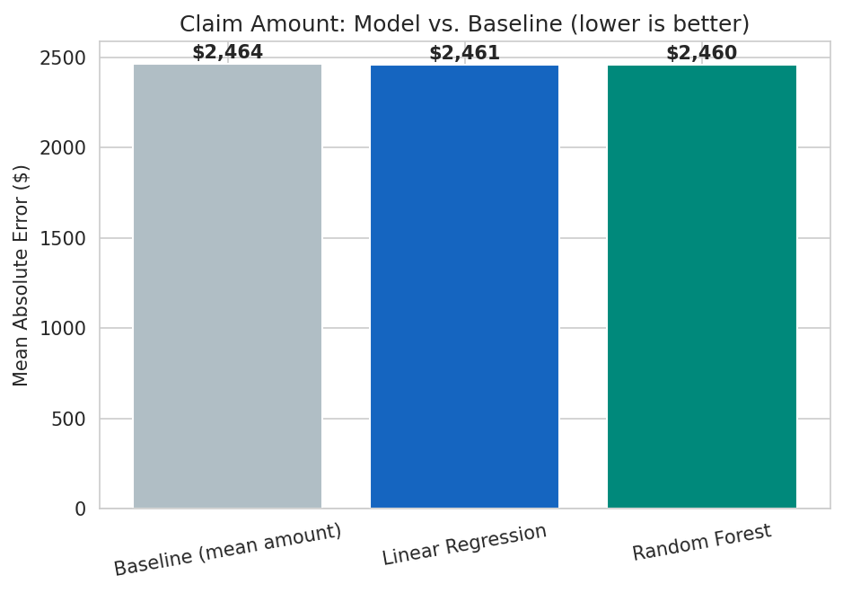

# UnderSure.AI — Machine Learning for Motor Insurance Risk Assessment

A machine learning pipeline that scores motor insurance applicants into risk
tiers (Low / Medium / High) and predicts claim likelihood and claim
severity, built on a 37,500-policy dataset. This started as an MBA capstone
project (Amity University Online) framed around a simulated
underwriting-automation case study. This repo is the working code behind
that project, cleaned up, tested, and reproducible from scratch.

It includes a trained Random Forest risk classifier (77.7% accuracy,
5-fold CV std ±0.33%), two claims models, 15 evaluation/EDA charts, a test
suite, and a Streamlit demo app you can run locally.

## Table of contents

- [Business problem](#business-problem)
- [Repository structure](#repository-structure)
- [How the risk label was built (read this first)](#how-the-risk-label-was-built-read-this-first)
- [Results](#results)
- [Quickstart](#quickstart)
- [Running the interactive demo](#running-the-interactive-demo)
- [Testing](#testing)
- [Tech stack](#tech-stack)
- [Limitations](#limitations)
- [Author](#author)

## Business problem

Manual motor insurance underwriting is slow (days per application) and
inconsistent: the same application can get different risk classifications
depending on which underwriter reviews it. This project looks at whether a
model trained on policyholder demographics, vehicle attributes, and usage
patterns can produce a fast, consistent, explainable first-pass risk
assessment, the kind of decision-support layer insurers use to triage
standard applications and send only the borderline ones to a human
underwriter.

## Repository structure

```
UnderSure-AI/
├── data/
│   ├── raw/insurance_policies_data.xlsx   # source dataset (37,542 policies)
│   └── processed/                          # generated at runtime, gitignored
├── src/
│   ├── config.py              # paths, constants, risk-labeling weights
│   ├── data_prep.py           # load + clean the raw export
│   ├── features.py            # feature engineering (age, vehicle age, etc.)
│   ├── risk_labeling.py       # builds the Risk_Category proxy label
│   ├── eda.py                 # generates figures 01-10
│   ├── train_risk_model.py    # trains/compares/selects the risk classifier
│   ├── train_claims_models.py # claim frequency + claim amount models
│   └── utils.py                # shared plotting/metrics helpers
├── notebooks/                  # narrated, executed versions of the src/ pipeline
│   ├── 01_EDA.ipynb
│   ├── 02_Feature_Engineering.ipynb
│   ├── 03_Risk_Model_Training.ipynb
│   └── 04_Claims_Models.ipynb
├── app/
│   └── streamlit_app.py        # interactive risk-scoring demo
├── models/                      # trained .joblib pipelines, gitignored
├── reports/
│   ├── figures/                 # 15 committed PNGs (EDA + evaluation)
│   └── metrics.json             # committed, full numeric results
├── tests/
│   └── test_pipeline.py         # 11 tests over cleaning/features/labeling
└── .github/workflows/tests.yml  # CI: runs the test suite on every push
```

Trained model binaries (`models/*.joblib`) aren't committed. They're
reproducible in under a minute by running the training scripts, and
keeping large binaries out of git history is the right default for an ML
repo. Figures and `metrics.json` are committed, so the results show up
directly on GitHub without cloning anything.

## How the risk label was built (read this first)

The raw dataset has policyholder demographics, vehicle details, and real
claims history, but no ground-truth underwriting risk decision. To train a
risk classifier at all, `src/risk_labeling.py` builds a documented,
transparent proxy label instead:

1. Ten risk factors (customer age, kids driving, household income, vehicle
   year/age, commercial vs. private use, parent status, coverage zone,
   education, gender) are each converted to a normalized 0-1 "riskiness"
   score with a clear, inspectable rule (see `src/features.py:compute_risk_components`).
2. These are combined into one score using fixed weights (`config.RISK_WEIGHTS`).
3. Calibrated Gaussian noise is added so the label reflects real-world
   unpredictability instead of being a trivially learnable function of the
   same features the model sees.
4. The result is bucketed into Low / Medium / High at fixed quantiles.

This is a proxy, not ground truth, and it's disclosed here on purpose. If
this comes up in an interview, the honest answer is roughly: there's no
historical underwriting decision in this dataset, so I built a
transparent, weighted rule from documented risk factors and treated
recovering it from raw features as the modeling problem. That's a more
credible answer than pretending the label is real, and it's a decent
segue into what a real underwriting-decisions table would need: loss
ratios, bind/decline outcomes, claims tied back to the original decision.

The two claims models (`src/train_claims_models.py`) are different. They
use real columns, `Claim Freq` and `Claim Amount`, with no engineering
involved. Their weak result (see below) is a legitimate finding, not
something to hide.

## Results

### Risk classification (Low / Medium / High)

| Algorithm | Accuracy | Precision | Recall | F1 | Train time |
|---|---|---|---|---|---|
| Logistic Regression | 72.3% | 69.6% | 72.3% | 70.1% | 0.3s |
| Random Forest (selected) | 77.7% | 76.4% | 77.7% | 76.5% | 1.0s |
| Gradient Boosting | 79.7% | 79.3% | 79.7% | 79.3% | 20.0s |

Gradient Boosting scores about 2 points higher on raw accuracy. Random
Forest is selected anyway: it's 20x faster to train, much easier to
explain to an underwriter through `feature_importances_`, and less likely
to be overfitting the noisy proxy label. Full numbers, including 5-fold CV
(77.7% ± 0.33%), are in `reports/metrics.json`.





Customer age (29.8%), kids driving (16.5%), and household income (12.4%)
carry over half the model's decision weight between them, which lines up
with standard actuarial risk factors.

### Claims models (frequency and severity, real targets)

| Model | Metric | Baseline | Model |
|---|---|---|---|
| Claim frequency (classification) | ROC-AUC | 50.0% | 50.3% |
| Claim amount (regression) | MAE | $2,464 | $2,460 |

Both barely beat a naive baseline, and that's reported as-is rather than
massaged. Claim occurrence and severity in this dataset show almost no
dependence on policyholder demographics, which is a fair reminder that
idiosyncratic claim risk (accidents, weather, plain bad luck) dominates
over anything derivable from demographics alone. It's also why real
insurers lean on telematics and claims-history data instead.




### Exploratory data analysis

10 more figures (risk distribution, age pattern, vehicle age, income, car
use, coverage zone, education, kids driving, correlation heatmap) live in
`reports/figures/01_*.png` through `10_*.png` and are walked through in
`notebooks/01_EDA.ipynb`.

## Quickstart

Requires Python 3.10+. No paid services or API keys, everything here is
free and open source.

```bash
git clone <your-repo-url>
cd UnderSure-AI

python -m venv venv
source venv/bin/activate          # Windows: venv\Scripts\activate

pip install -r requirements.txt

# Run the pipeline end to end (each step is idempotent and fast: ~1 min total)
python -m src.eda
python -m src.train_risk_model
python -m src.train_claims_models
```

This regenerates everything in `models/` and `reports/` from the raw data
in `data/raw/`.

## Running the interactive demo

```bash
streamlit run app/streamlit_app.py
```

Opens a local form where you enter a hypothetical applicant's details
(age, income, vehicle year, kids driving, usage type, and so on) and get
back a predicted risk tier with class probabilities, an estimated claim
likelihood, and an estimated claim amount if a claim occurs. The "About
this demo" section in the app repeats the proxy-label / honest-results
caveat above, so it's never presented as a real underwriting tool.

## Testing

```bash
pip install pytest
pytest tests/ -v
```

11 tests cover data cleaning (duplicate IDs, value ranges, a typo fix in
`Marital Status`), feature engineering (age/vehicle-age plausibility,
`Has_Claim` consistency), and risk labeling (score reproducibility, class
balance, determinism given a fixed seed). CI (`.github/workflows/tests.yml`)
runs this suite on every push.

## Tech stack

pandas, numpy, scikit-learn, matplotlib, seaborn, joblib, Streamlit,
Jupyter. All free and open source, nothing paid or API-gated.

## Limitations

Worth being upfront about a few things. `Risk_Category` is a documented
rule-based proxy, not a real underwriting outcome, and that's the single
most important thing to disclose about this project. The dataset covers a
fixed historical window, so there's no train-on-past, test-on-future
validation since the export doesn't have fine-grained dates. The claims
models show weak signal from demographics alone; a real deployment would
need telematics or richer claims-history features. And this is a
portfolio project, not a production underwriting system. It shouldn't be
used to make real coverage or pricing decisions.

## Author

Ayush Vashist. Built as an MBA capstone project (Amity University
Online), reworked here into a reproducible, tested codebase.
